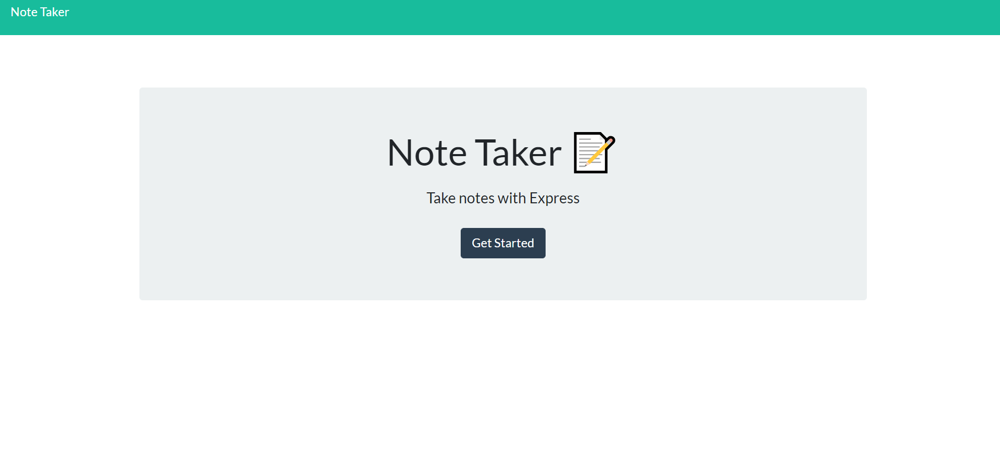

  # Note Taker

  

  ## Table of Contents:

  * [Description](#Description)

  * [Installation](#Installation)

  * [Usage](#Usage)

  * [Contributions](#Contributions)

  * [Test](#Tests)

  * [Email](#Questions)

  * [Github](#Questions)

  ## Description: 
  This project saves and reads notes from a json file

  ## Installation: 
  This project requires node and uniqid,
  use npm install for both
  
  ## Usage: 
  none

  ## License:
  none 
  
  ## Contributions: 
  no contributions needed

  ## Tests: 
  none needed

  ## Questions:

  [Email](mailto:gabeab34@gmail.com)

  [GitHub](https://github.com/gabeab34)

